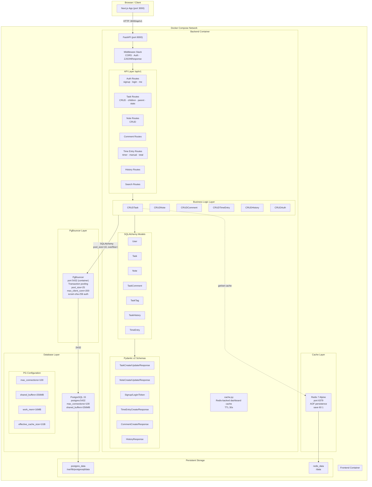
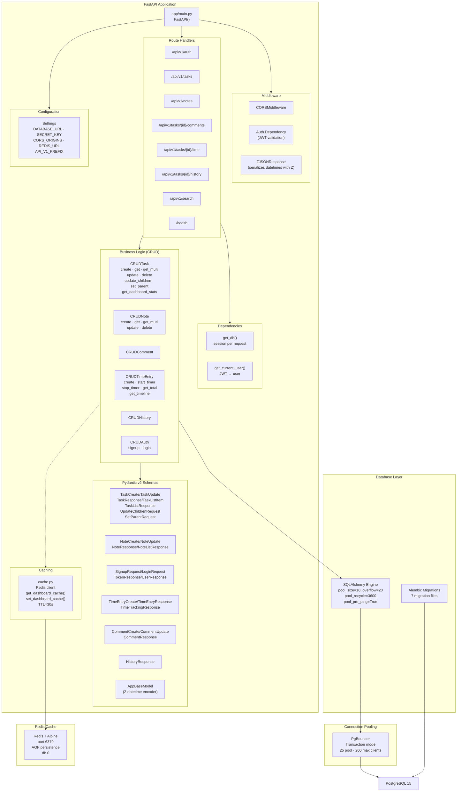
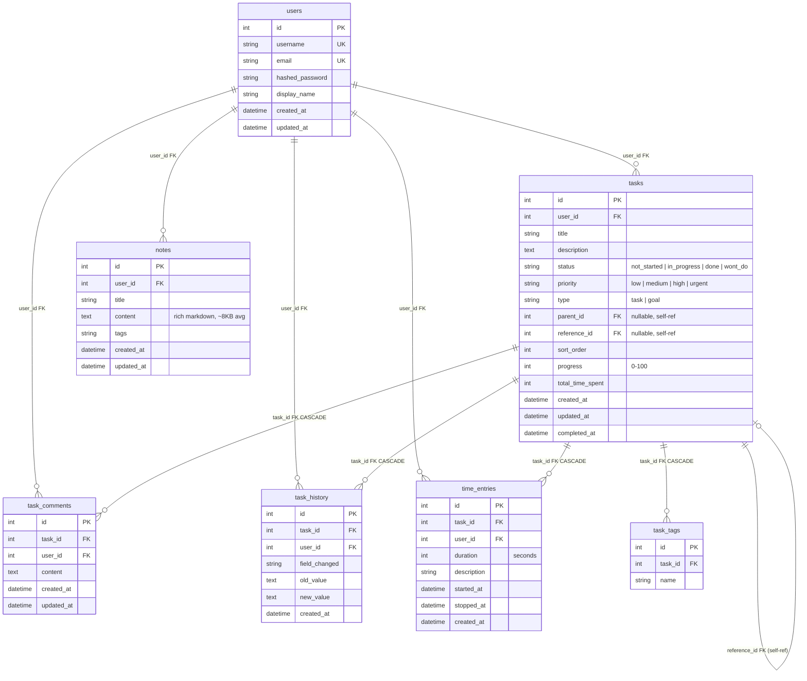

# Architecture

## Full System Architecture



## Frontend Architecture

```mermaid
graph TB
    subgraph NextJS["Next.js 14 App Router"]
        LAYOUT["Root Layout<br/>layout.tsx"]

        subgraph PAGES["Pages (App Router)"]
            HOME["/ — Home"]
            DASHBOARD["/dashboard"]
            TASKS["/tasks"]
            TASK_DETAIL["/tasks/[id]"]
            NOTES["/notes"]
            LOGIN["/login"]
            SIGNUP["/signup"]
            HELP["/help"]
            ABOUT["/about"]
        end

        subgraph COMPONENTS["Component Library"]
            subgraph LAYOUT_COMP["Layout"]
                HEADER["Header"]
                SIDEBAR["Sidebar"]
            end

            subgraph DASHBOARD_COMP["Dashboard"]
                STATS_CARD["StatsCard"]
                RECENT_ACTIVITY["RecentActivity"]
                TIME_TIMELINE["TimeTimelineChart"]
                MINI_RING["MiniRing"]
            end

            subgraph TASK_COMP["Tasks"]
                TASK_LIST["TaskList"]
                TASK_CARD["TaskCard"]
                TASK_DETAIL_COMP["TaskDetail"]
                TASK_FORM["TaskForm"]
            end

            subgraph NOTES_COMP["Notes"]
                NOTE_EDITOR["NoteEditor"]
                EDITOR_TOOLBAR["EditorToolbar"]
            end

            subgraph UI["UI Primitives (shadcn/ui)"]
                BUTTON["Button"]  DIALOG["Dialog"]
                SELECT["Select"]  POPOVER["Popover"]
                COMMAND["Command"] INPUT["Input"]
                BADGE["Badge"]    CARD["Card"]
                DROPDOWN["DropdownMenu"]
                TEXTAREA["Textarea"]
                SEPARATOR["Separator"]
                SKELETON["Skeleton"]
                TOGGLE["Toggle"]
                TOOLTIP["Tooltip"]
            end

            THEME["ThemeProvider"]
        end

        subgraph STATE["State & Data Fetching"]
            subgraph ZUSTAND["Zustand Stores"]
                AUTH_STORE["auth-store"]
                FILTER_STORE["filter-store"]
                SEARCH_STORE["search-store"]
                TASK_STORE["task-store"]
            end

            subgraph REACT_QUERY["React Query Hooks"]
                USE_TASKS["useTasks<br/>useTask<br/>useCreateTask<br/>useUpdateTask<br/>useDeleteTask<br/>useSetTaskParent<br/>useUpdateTaskChildren"]
                USE_NOTES["useNotes<br/>useNote<br/>useCreateNote<br/>useUpdateNote<br/>useDeleteNote"]
                USE_COMMENTS["useComments<br/>useCreateComment<br/>useDeleteComment"]
                USE_TIME["useTimeEntries<br/>useTotalTime<br/>useStartTimer<br/>useStopTimer<br/>useAddManualEntry"]
            end
        end

        subgraph API["API Client Layer"]
            CLIENT["api/client.ts<br/>(fetch wrapper + JWT, get/post/patch/put/delete)"]
            TASKS_API["tasks.ts"]
            NOTES_API["notes.ts"]
            COMMENTS_API["comments.ts"]
            TIME_API["time.ts"]
            AUTH_API["auth.ts"]
        end
    end

    LAYOUT --> PAGES
    LAYOUT --> COMPONENTS
    PAGES --> COMPONENTS
    COMPONENTS --> UI
    COMPONENTS --> THEME
    COMPONENTS --> STATE
    STATE --> ZUSTAND
    STATE --> REACT_QUERY
    REACT_QUERY --> API
    API --> CLIENT
    CLIENT -->|HTTP| BACKEND["Backend :8000/api/v1"]
    LAYOUT_COMP --> HEADER
    LAYOUT_COMP --> SIDEBAR
```

## Backend Architecture



## Database Schema



## Indexes

Migration `0005_add_composite_indexes.py` created 8 indexes targeting the most common query patterns:

| Index Name | Table | Columns | Type | Purpose |
|---|---|---|---|---|
| `ix_tasks_user_status` | tasks | `(user_id, status)` | B-tree | Filter by status (done/in_progress) |
| `ix_tasks_user_priority` | tasks | `(user_id, priority)` | B-tree | Filter by priority (urgent/high) |
| `ix_tasks_user_created` | tasks | `(user_id, created_at)` | B-tree | Sort by created date |
| `ix_tasks_user_updated` | tasks | `(user_id, updated_at)` | B-tree | Date range filters on dashboard |
| `ix_history_task_created` | task_history | `(task_id, created_at)` | B-tree | History chronology for a task |
| `ix_time_task_created` | time_entries | `(task_id, created_at)` | B-tree | Time entry chronology |
| `ix_notes_user_updated` | notes | `(user_id, updated_at)` | B-tree | Notes list sorted by update time |
| `ix_notes_content_trgm` | notes | `content` | GIN (`gin_trgm_ops`) | Trigram full-text search on note content |

## Key Decisions

### Architecture
- **PgBouncer over direct Postgres** — Prevents connection RAM exhaustion at scale (Instagram's lesson: each PG connection costs ~5MB). Backend connects to `pgbouncer:5432` (transaction pooling, 25 pool size, 200 max clients). Postgres itself stays at `max_connections=100` but PgBouncer multiplexes many more client connections.
- **Redis over in-memory dict** — Dashboard stats cache (30s TTL) moved from Python dict to Redis: survives container restarts, shared across multiple backend instances, native TTL eviction with `decode_responses=True`.
- **Connection pool** — SQLAlchemy `pool_size=10`, `max_overflow=20`, `pool_recycle=3600`, `pool_pre_ping=True`. All references go through PgBouncer which pools onto 25 PG connections.
- **GIN trigram index** — On `notes.content` for fast substring/fuzzy search. Chosen over `tsvector` for simplicity: trigram handles partial matches and typos without a separate search index.

### API Design
- **UTC + Z suffix** — API returns `2026-06-11T05:34:45.780718Z`. Backend uses `datetime.utcnow()`. Frontend converts to browser local timezone via `date-fns format()`.
- **Comma-separated multi-select** — Filter params like `?status=done,not_started` rather than array query params, avoiding URL parsing ambiguity.
- **Dedicated goal management endpoints** — `POST /tasks/{goal_id}/children` (bulk replace children) and `PUT /tasks/{task_id}/parent` (link/unlink) instead of individual PATCH calls, ensuring atomicity and server-side validation.
- **Separate response schemas** — `TaskResponse` includes `children[]` (for detail view), `TaskListItem` omits it (for list view), minimizing payload.

### Frontend
- **Glass morphism** — Cards use `bg-card/50 backdrop-blur-sm border` with no `box-shadow`. Elevation from blur + transparency alone.
- **Combobox over native Select** — Goal/parent/reference pickers use `Popover` + `Command` + `cmdk` for searchability with 200+ items. Native `<Select>` is only for status/priority (small fixed sets).
- **No Portal inside Dialog** — `SelectContent` and `PopoverContent` have `<Portal>` wrappers removed globally to prevent Radix focus-management crash when nested inside `Dialog` (known `@radix-ui/react-select@^2.0.0` bug).
- **Local state + Save for goal management** — TaskDetail's "Manage Tasks" popover keeps `childIds` locally; only calls `updateTaskChildren` on Save button click, avoiding a mutation per add/remove.

### Color & Theming
- **Light mode**: warm brown/beige palette (`#f5f0eb` backgrounds, `#8b7355` accents).
- **Dark mode**: warm charcoal (`#1a1a1a` backgrounds, `#e0d5c1` text).
- **System-aware**: Defaults to `system` theme with `ThemeProvider`; user can override to light/dark.
