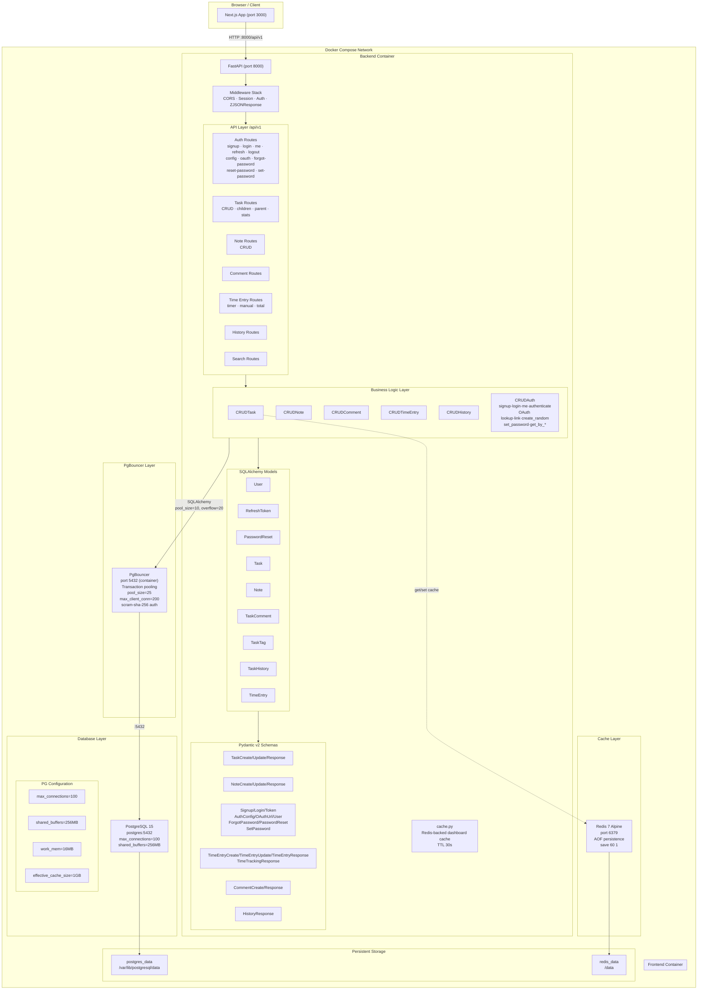
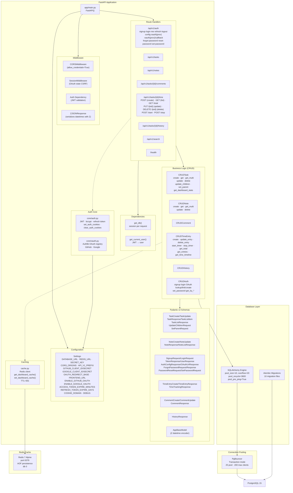
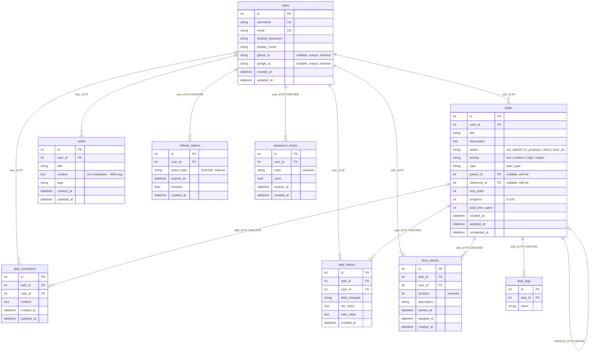

# Architecture

## Full System Architecture



## Frontend Architecture

```mermaid
graph TB
    subgraph NextJS["Next.js 14 App Router"]
        LAYOUT["Root Layout<br/>layout.tsx"]

        subgraph PAGES["Pages (App Router)"]
            HOME["/ — Home"]
            DASHBOARD["/dashboard"]
            TASKS["/tasks"]
            TASK_DETAIL["/tasks/[id]"]
            NOTES["/notes"]
            LOGIN["/login"]
            SIGNUP["/signup"]
            HELP["/help"]
            ABOUT["/about"]
        end

        subgraph COMPONENTS["Component Library"]
            subgraph LAYOUT_COMP["Layout"]
                HEADER["Header"]
                SIDEBAR["Sidebar"]
            end

            subgraph DASHBOARD_COMP["Dashboard"]
                STATS_CARD["StatsCard"]
                RECENT_ACTIVITY["RecentActivity"]
                TIME_TIMELINE["TimeTimelineChart"]
                MINI_RING["MiniRing"]
            end

            subgraph TASK_COMP["Tasks"]
                TASK_LIST["TaskList"]
                TASK_CARD["TaskCard"]
                TASK_DETAIL_COMP["TaskDetail"]
                TASK_FORM["TaskForm"]
            end

            subgraph NOTES_COMP["Notes"]
                NOTE_EDITOR["NoteEditor"]
                EDITOR_TOOLBAR["EditorToolbar"]
            end

            subgraph UI["UI Primitives (shadcn/ui)"]
                BUTTON["Button"]  DIALOG["Dialog"]
                SELECT["Select"]  POPOVER["Popover"]
                COMMAND["Command"] INPUT["Input"]
                BADGE["Badge"]    CARD["Card"]
                DROPDOWN["DropdownMenu"]
                TEXTAREA["Textarea"]
                SEPARATOR["Separator"]
                SKELETON["Skeleton"]
                TOGGLE["Toggle"]
                TOOLTIP["Tooltip"]
            end

            THEME["ThemeProvider"]
            COMPLEXITY["PasswordComplexity"]
        end

        subgraph STATE["State & Data Fetching"]
            subgraph ZUSTAND["Zustand Stores"]
                AUTH_STORE["auth-store"]
                FILTER_STORE["filter-store"]
                SEARCH_STORE["search-store"]
                TASK_STORE["task-store"]
            end

            subgraph REACT_QUERY["React Query Hooks"]
                USE_TASKS["useTasks<br/>useTask<br/>useCreateTask<br/>useUpdateTask<br/>useDeleteTask<br/>useSetTaskParent<br/>useUpdateTaskChildren"]
                USE_NOTES["useNotes<br/>useNote<br/>useCreateNote<br/>useUpdateNote<br/>useDeleteNote"]
                USE_COMMENTS["useComments<br/>useCreateComment<br/>useDeleteComment"]
                USE_TIME["useTimeEntries<br/>useTotalTime<br/>useStartTimer<br/>useStopTimer<br/>useAddManualEntry<br/>useUpdateTimeEntry<br/>useDeleteTimeEntry"]
            end
        end

        subgraph API["API Client Layer"]
            CLIENT["api/client.ts<br/>(fetch wrapper + JWT, get/post/patch/put/delete)"]
            TASKS_API["tasks.ts"]
            NOTES_API["notes.ts"]
            COMMENTS_API["comments.ts"]
            TIME_API["time.ts"]
            AUTH_API["auth.ts"]
        end
    end

    LAYOUT --> PAGES
    LAYOUT --> COMPONENTS
    PAGES --> COMPONENTS
    COMPONENTS --> UI
    COMPONENTS --> THEME
    COMPONENTS --> STATE
    STATE --> ZUSTAND
    STATE --> REACT_QUERY
    REACT_QUERY --> API
    API --> CLIENT
    CLIENT -->|HTTP| BACKEND["Backend :8000/api/v1"]
    LAYOUT_COMP --> HEADER
    LAYOUT_COMP --> SIDEBAR
```

## Backend Architecture



## Database Schema



## Indexes

The application uses 10 migration files with indexes targeting query patterns and auth lookups:

| Index Name | Table | Columns | Type | Migration | Purpose |
|---|---|---|---|---|---|
| `ix_tasks_user_status` | tasks | `(user_id, status)` | B-tree | 0005 | Filter by status (done/in_progress) |
| `ix_tasks_user_priority` | tasks | `(user_id, priority)` | B-tree | 0005 | Filter by priority (urgent/high) |
| `ix_tasks_user_created` | tasks | `(user_id, created_at)` | B-tree | 0005 | Sort by created date |
| `ix_tasks_user_updated` | tasks | `(user_id, updated_at)` | B-tree | 0005 | Date range filters on dashboard |
| `ix_history_task_created` | task_history | `(task_id, created_at)` | B-tree | 0005 | History chronology for a task |
| `ix_time_task_created` | time_entries | `(task_id, created_at)` | B-tree | 0005 | Time entry chronology |
| `ix_notes_user_updated` | notes | `(user_id, updated_at)` | B-tree | 0005 | Notes list sorted by update time |
| `ix_notes_content_trgm` | notes | `content` | GIN (`gin_trgm_ops`) | 0005 | Trigram full-text search on note content |
| `ix_refresh_token_hash` | refresh_tokens | `(token_hash)` | B-tree | 0006 | Refresh token lookup (SHA256 hash) |
| `ix_refresh_token_user` | refresh_tokens | `(user_id)` | B-tree | 0006 | Revoke all tokens for user on logout |
| `ix_users_github_id` | users | `(github_id)` | B-tree | 0007 | OAuth GitHub login lookup |
| `ix_users_google_id` | users | `(google_id)` | B-tree | 0007 | OAuth Google login lookup |
| `ix_password_reset_code` | password_resets | `(code)` | B-tree | 0008 | Reset code lookup |
| `ix_password_reset_user` | password_resets | `(user_id)` | B-tree | 0008 | Find existing codes for user |

## Key Decisions

### Architecture
- **PgBouncer over direct Postgres** — Prevents connection RAM exhaustion at scale (Instagram's lesson: each PG connection costs ~5MB). Backend connects to `pgbouncer:5432` (transaction pooling, 25 pool size, 200 max clients). Postgres itself stays at `max_connections=100` but PgBouncer multiplexes many more client connections.
- **Redis over in-memory dict** — Dashboard stats cache (30s TTL) moved from Python dict to Redis: survives container restarts, shared across multiple backend instances, native TTL eviction with `decode_responses=True`.
- **Connection pool** — SQLAlchemy `pool_size=10`, `max_overflow=20`, `pool_recycle=3600`, `pool_pre_ping=True`. All references go through PgBouncer which pools onto 25 PG connections.
- **GIN trigram index** — On `notes.content` for fast substring/fuzzy search. Chosen over `tsvector` for simplicity: trigram handles partial matches and typos without a separate search index.

### API Design
- **UTC + Z suffix** — API returns `2026-06-11T05:34:45.780718Z`. Backend uses `datetime.utcnow()`. Frontend converts to browser local timezone via `date-fns format()`.
- **Comma-separated multi-select** — Filter params like `?status=done,not_started` rather than array query params, avoiding URL parsing ambiguity.
- **Dedicated goal management endpoints** — `POST /tasks/{goal_id}/children` (bulk replace children) and `PUT /tasks/{task_id}/parent` (link/unlink) instead of individual PATCH calls, ensuring atomicity and server-side validation.
- **Separate response schemas** — `TaskResponse` includes `children[]` (for detail view), `TaskListItem` omits it (for list view), minimizing payload.

### Frontend
- **Glass morphism** — Cards use `bg-card/50 backdrop-blur-sm border` with no `box-shadow`. Elevation from blur + transparency alone.
- **Combobox over native Select** — Goal/parent/reference pickers use `Popover` + `Command` + `cmdk` for searchability with 200+ items. Native `<Select>` is only for status/priority (small fixed sets).
- **No Portal inside Dialog** — `SelectContent` and `PopoverContent` have `<Portal>` wrappers removed globally to prevent Radix focus-management crash when nested inside `Dialog` (known `@radix-ui/react-select@^2.0.0` bug).
- **Local state + Save for goal management** — TaskDetail's "Manage Tasks" popover keeps `childIds` locally; only calls `updateTaskChildren` on Save button click, avoiding a mutation per add/remove.
- **Progress slider with local state** — The range input updates a `localProgress` state variable on every `onChange` event for instant visual feedback, but only calls `updateTask.mutate` on `onPointerUp` (cursor release) or keyboard `onKeyUp`. A `useEffect` clears local state once the server value catches up via query cache invalidation. This prevents dozens of API calls and DB writes per drag.
- **Search flattens child tasks** — When a search keyword is active, the task list `useMemo` flattens child tasks into the standalone list. A parent goal badge (`Goal #N`) is shown above each flattened child for context. Normal grouping by goal is restored when search is cleared.
- **Goal row field alignment** — Goal rows in the list match the standalone `TaskCard` column order: progress bar → status → priority → tags → time → created. Progress bar uses the same `transition-all duration-300 ease-in-out` as `TaskCard`.
- **Time entry edit/delete** — Each time entry row has edit/delete buttons revealed on hover (`group-hover:opacity-100`). Edit mode shows inline inputs for duration (number, max 1440) and description. Updates are sent via `PUT /tasks/{task_id}/time/{entry_id}`, deletes via `DELETE /tasks/{task_id}/time/{entry_id}`. Both operations recalculate task total_time_spent on the server and log to task_history. Maximum duration is 1440 minutes (86400 seconds), validated on both frontend (slider max, button gating) and backend (Pydantic `@field_validator`).

### Color & Theming
- **Light mode**: warm brown/beige palette (`#f5f0eb` backgrounds, `#8b7355` accents).
- **Dark mode**: warm charcoal (`#1a1a1a` backgrounds, `#e0d5c1` text).
- **System-aware**: Defaults to `system` theme with `ThemeProvider`; user can override to light/dark.

### Authentication & Security
- **httpOnly cookies over localStorage** — Prevents XSS token theft. `access_token` (15 min) and `refresh_token` (7 days) are both httpOnly and SameSite=strict. Refresh token has a restricted path (`/api/v1/auth`) to minimize cookie attachment.
- **Refresh token rotation** — Refresh tokens are random `secrets.token_urlsafe(48)` strings (not JWTs), stored as SHA256 hashes in the `refresh_tokens` table. Each rotation revokes the old token (single-use). If a revoked token is presented, all tokens for that user are invalidated (reuse detection).
- **Authorization: Bearer fallback** — For cross-origin dev (frontend `:3001`, backend `:8000`), the OAuth callback passes tokens in the URL hash fragment (`#access_token=...&refresh_token=...`). The frontend extracts them, stores in-memory in Zustand, and sends via `Authorization: Bearer` header. The `get_current_user` dependency checks the `Authorization` header first, then falls back to the `access_token` cookie.
- **AuthGuard blank-page fix** — After extracting tokens from the URL hash, the AuthGuard calls `GET /auth/me` to fetch the user profile before marking the check as complete. This prevents a flash of the MainLayout with a null user.

### OAuth
- **Authlib integration** — Uses `authlib.integrations.starlette_client.OAuth` for GitHub (scope: `user:email`) and Google (OpenID Connect: `openid email profile`). `SessionMiddleware` is required for Authlib's OAuth state CSRF protection (stores state in a signed session cookie).
- **`save_authorize_data()` required** — `create_authorization_url()` only generates the URL and state; it does NOT persist state to the session. You must call `await client.save_authorize_data(request, redirect_uri=..., **resp)` immediately afterward.
- **`redirect_uri` not passed to `authorize_access_token()`** — The redirect URI is already stored in saved state data and injected by `_format_state_params`. Passing it as a kwarg causes a duplicate argument error.
- **Auto-linking by email** — On OAuth callback, if no user exists with the provider's ID, the system searches by email. If a match is found, the provider ID is linked to that existing account. If no user exists at all, a new account is created with a random password.
- **Configurable OAuth toggle** — `ENABLE_GITHUB_OAUTH` / `ENABLE_GOOGLE_OAUTH` (`bool | None`, default `None`). When unset, auto-detects from credential presence. Explicit `false` overrides auto-detect. The frontend fetches `GET /auth/config` on the login page to conditionally show/hide OAuth buttons. The forgot-password response also filters linked providers against these global flags.

### Password Management
- **No SMTP server** — Password reset codes are generated via `secrets.token_hex(4)` and returned directly in the API response. The code is displayed on-screen for the user (suitable for self-hosted/local deployments). Codes expire after 15 minutes and are single-use.
- **OAuth user password** — Users who signed up via OAuth can set a password via `POST /auth/set-password` (with `current_password: null`). Existing password users must provide their current password to set a new one. Both flows revoke all existing refresh tokens.

### Secrets Management
- **Docker Secrets** — Sensitive values (`SECRET_KEY`, `GITHUB_CLIENT_ID/SECRET`, `GOOGLE_CLIENT_ID/SECRET`) are mounted as files in `/run/secrets/<name>` and mapped from `backend/secrets/*.txt` in docker-compose. The `config.py` `_read_secret()` function reads from the file path first, falling back to environment variables. In production, swap local files for K8s secrets or HashiCorp Vault.
- **`.gitignore`** — `backend/secrets/*.txt` is gitignored (with an exception for `.gitkeep`). Example files (`*.txt.example`) are committed as safe templates.
