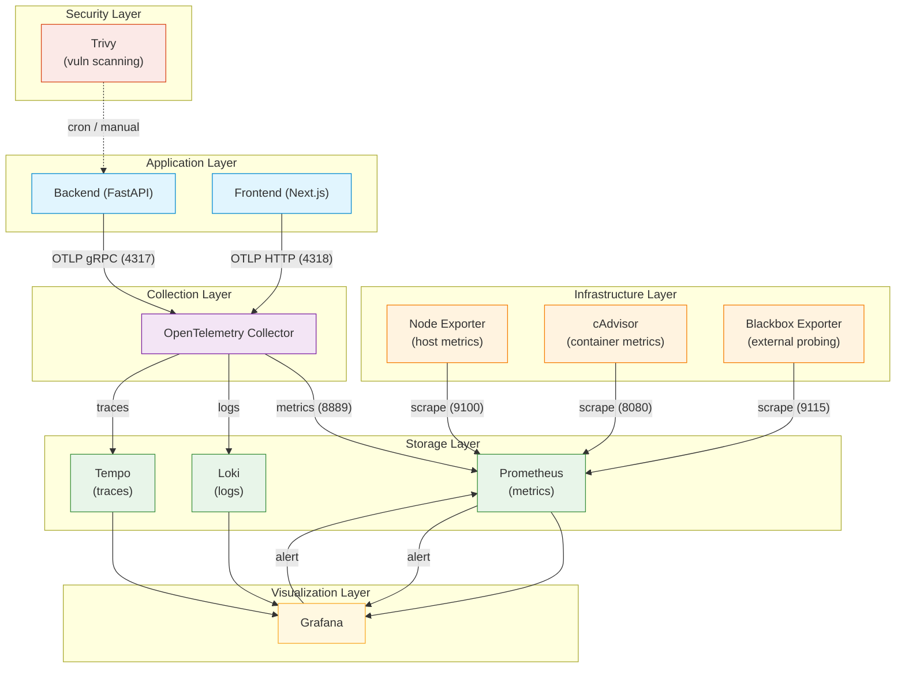

# Observability Platform Architecture

## Overview

On-prem observability stack for the task-tracker application.
Resource budget: <=3 CPU, <=8 GB RAM, <=300 GB storage.

## Workflow Diagram



## Data Flow by Pillar

### Metrics Pipeline
```
App Backend --[OTLP]--> OTel Collector --[prometheusexporter]--> Prometheus
Node Exporter ----------------------------------------------> Prometheus (direct scrape)
cAdvisor ---------------------------------------------------> Prometheus (direct scrape)
Blackbox Exporter ------------------------------------------> Prometheus (direct scrape)
Prometheus --[datasource]--> Grafana (dashboards & alerts)
```

### Logs Pipeline
```
App Backend --[OTLP]--> OTel Collector --[loki exporter]--> Loki --[datasource]--> Grafana
```

### Traces Pipeline
```
App Backend --[OTLP]--> OTel Collector --[otlp exporter]--> Tempo --[datasource]--> Grafana
App Frontend --[OTLP]--> OTel Collector -------------------> Tempo
```

### Alert Pipeline
```
Prometheus rules --> Prometheus alertmanager --> Grafana alerting --> Notification channel
                                                                     (email / Slack / Discord)
```

## Component Breakdown

### 1. Application Telemetry (App Layer)

#### Backend (FastAPI + Python)
- **Image**: Built from `backend/Dockerfile`
- **Instrumentation**: Auto-instrumented via `opentelemetry-distro` + `opentelemetry-instrumentation`
- **Exporter**: OTLP gRPC to `otel-collector:4317`
- **Telemetry**: Traces, metrics, logs
- **Network**: `todos-net` (app) + `obs-net` (otel)
- **Key packages**: `opentelemetry-instrumentation-fastapi`, `opentelemetry-instrumentation-sqlalchemy`, `opentelemetry-instrumentation-httpx`
- **Entrypoint**: `entrypoint.sh` calls `opentelemetry-bootstrap -a install` then wraps uvicorn with `opentelemetry-instrument`

#### Frontend (Next.js)
- **Image**: Built from `frontend/Dockerfile`
- **Instrumentation**: `Instrumentation.ts` using `@opentelemetry/sdk-node`
- **Exporter**: OTLP HTTP to `otel-collector:4318`
- **Telemetry**: Traces only (client-side metrics limited)
- **Network**: `todos-net` (app)

### 2. Infrastructure Metrics (Infrastructure Layer)

#### Node Exporter
- **Image**: `prom/node-exporter:v1.7.0`
- **Role**: Host-level system metrics (CPU, memory, disk, network)
- **Port**: 9100
- **Scraped by**: Prometheus (30s interval)
- **Network**: `obs-net`
- **Flags**: `--path.rootfs=/host`, `--path.procfs=/host/proc`, `--path.sysfs=/host/sys`

#### cAdvisor
- **Image**: `gcr.io/cadvisor/cadvisor:v0.49.1`
- **Role**: Container-level metrics (per-container CPU, memory, filesystem, network)
- **Port**: 8080
- **Scraped by**: Prometheus (60s interval — lower frequency due to cardinality)
- **Network**: `obs-net`
- **Volumes**: `/:/rootfs:ro`, `/var/run/docker.sock:/var/run/docker.sock:ro`, etc.

#### Blackbox Exporter
- **Image**: `prom/blackbox-exporter:v0.25.0`
- **Role**: External endpoint probing (HTTP/HTTPS health checks)
- **Port**: 9115
- **Scraped by**: Prometheus (with `__param_target` relabeling)
- **Network**: `obs-net`
- **Config**: `blackbox.yml` defines HTTP prober module
- **Targets**: `https://do.dharapx.work`, `https://do.dharapx.work/api/v1/health`

### 3. OpenTelemetry Collector (Collection Layer)

- **Image**: `otel/opentelemetry-collector-contrib:0.97.0`
- **Role**: Central telemetry pipeline — receives OTLP from apps, fans out to backends
- **Ports**: 4317 (gRPC), 4318 (HTTP), 8889 (metrics), 8888 (health)
- **Network**: `obs-net`
- **Pipeline**:
  1. **Receivers**: `otlp` (gRPC + HTTP)
  2. **Processors**: `batch`, `memory_limiter`, `attributes` (adds `environment=production`), `filter` (drops health-check traces)
  3. **Exporters**:
     - `prometheus` (exposes metrics on `:8889/metrics` for Prometheus to scrape)
     - `loki` (pushes logs to `loki:3100`)
     - `otlp` (forwards traces to `tempo:4317`)
- **Health**: Exposes `http://localhost:8888/health/status`

### 4. Storage Layer

#### Prometheus
- **Image**: `prom/prometheus:v2.47.0`
- **Role**: Time-series metrics database & alert rule evaluation
- **Port**: 9090
- **Storage**: 30d retention, 75 GB max, WAL compression enabled
- **Network**: `obs-net`
- **Scrape targets**:
  - prometheus (self, :9090)
  - otel-collector (:8889)
  - node-exporter (:9100)
  - cadvisor (:8080)
  - blackbox-exporter (:9115)
- **Alerting**: Rule files in `prometheus/rules/*.yml` evaluated every 30s
- **Config**: `prometheus.yml` with `--web.enable-lifecycle` for hot-reload
- **Reload**: `curl -X POST http://localhost:9090/-/reload`

#### Loki
- **Image**: `grafana/loki:3.0.0`
- **Role**: Log aggregation — receives logs from OTel Collector
- **Port**: 3100
- **Storage**: 30d retention, 100 GB max
- **Network**: `obs-net`
- **Ingestion**: OTel Collector pushes via Loki exporter at `loki:3100/loki/api/v1/push`
- **Config**: `loki-config.yml` with BoltDB shipper + filesystem storage

#### Tempo
- **Image**: `grafana/tempo:2.4.0`
- **Role**: Distributed tracing backend
- **Port**: 4317 (OTLP gRPC), 3200 (HTTP)
- **Storage**: 50 GB max
- **Network**: `obs-net`
- **Ingestion**: OTel Collector forwards traces via OTLP at `tempo:4317`
- **Config**: `tempo-config.yml` with local backend

### 5. Visualization Layer

#### Grafana
- **Image**: `grafana/grafana:10.4.3`
- **Role**: Dashboards, alerting, and unified visualization
- **Port**: 3000
- **Network**: `obs-net`
- **Provisioning**:
  - **Datasources**: Prometheus, Loki, Tempo (auto-configured via `datasources.yml`)
  - **Dashboards**: App metrics, Node Exporter, cAdvisor, Blackbox (auto-loaded via `dashboards.yml`)
  - **Alerting**: Pre-configured alert rules and notification policies in `alerting.yml`
- **Datasource URLs**:
  - Prometheus: `http://obs-prometheus:9090`
  - Loki: `http://obs-loki:3100`
  - Tempo: `http://obs-tempo:3200`
- **Access**: `https://grafana.dharapx.work` via Cloudflare tunnel

### 6. Security Layer

#### Trivy
- **Image**: `aquasec/trivy:0.51.1`
- **Role**: Vulnerability scanning (run on-demand, no persistent process)
- **Profile**: `security-scan` — not part of normal `docker compose up`
- **Run**: `docker compose --profile security-scan run trivy image todos-backend`
- **Cache**: 10 GB volume for vulnerability database

## Network Topology

```
┌─────────────────────────────────────────────────────────────┐
│                      obs-net (bridge)                       │
│                                                             │
│   ┌──────────┐  ┌──────────┐  ┌──────────┐  ┌──────────┐   │
│   │Prometheus│  │   Loki   │  │  Tempo   │  │  Grafana │   │
│   │   :9090  │  │  :3100   │  │  :4317   │  │  :3000   │   │
│   └────┬─────┘  └──────────┘  └──────────┘  └──────────┘   │
│        │                                                    │
│   ┌────▼─────┐  ┌──────────┐  ┌──────────┐  ┌──────────┐   │
│   │   OTel   │  │Node Exp. │  │ cAdvisor │  │Blackbox  │   │
│   │Collector │  │  :9100   │  │  :8080   │  │  :9115   │   │
│   │:4317/4318│  └──────────┘  └──────────┘  └──────────┘   │
│   └────┬─────┘                                             │
│        │                                                    │
└────────┼────────────────────────────────────────────────────┘
         │
         │ (shared obs-net network)
         │
┌────────▼────────────────────────────────────────────────────┐
│                    todos-net (app bridge)                    │
│                                                             │
│   ┌──────────┐  ┌──────────┐  ┌──────────┐  ┌──────────┐   │
│   │ Backend  │  │ Frontend │  │ Postgres │  │ PgBouncer│   │
│   │   :8000  │  │  :3000   │  │  :5432   │  │  :5432   │   │
│   └──────────┘  └──────────┘  └──────────┘  └──────────┘   │
│                                                             │
│   ┌──────────┐                                              │
│   │  Redis   │                                              │
│   │  :6379   │                                              │
│   └──────────┘                                              │
└─────────────────────────────────────────────────────────────┘
```

Key details:
- `obs-net` is a shared external bridge — created by `docker network create obs-net`
- The app's `docker-compose.yml` connects backend to `obs-net` for OTel telemetry
- All obs-infra services are on `obs-net` only
- App services (postgres, pgbouncer, redis, frontend) are on `todos-net` only
- No cross-network communication between app DBs and obs stack

## Resource Allocation

| Service | Role | CPU | RAM | Storage |
|---------|------|-----|-----|---------|
| Prometheus | Metrics storage & alerting | 0.5 | 2 GB | 75 GB |
| Loki | Log aggregation | 0.5 | 1.5 GB | 100 GB |
| Tempo | Distributed tracing | 0.5 | 1.5 GB | 50 GB |
| OTel Collector | OpenTelemetry pipeline | 0.5 | 1 GB | 5 GB |
| Grafana | Visualization & alerting | 0.3 | 512 MB | 5 GB |
| Node Exporter | Host metrics | 0.1 | 128 MB | - |
| cAdvisor | Container metrics | 0.1 | 128 MB | - |
| Blackbox Exporter | External probing | 0.1 | 128 MB | - |
| Trivy | Vulnerability scanning | 0.2 | 256 MB | 10 GB |
| **Total** | | **~2.8** | **~6.8 GB** | **~245 GB** |

## Alert Channels

- **Prometheus rules**: Evaluated every 30s; alerts sent to Grafana alertmanager
- **Grafana alerting**: Supports email (SMTP), webhook (Slack/Discord)
- **Default**: Silence (logs only). Configure receivers in Grafana UI → Alerting → Contact points

## First-Time Setup

```bash
# 1. Create external network and volumes (one-time)
docker network create obs-net
docker volume create prometheus-data
docker volume create loki-data
docker volume create tempo-data
docker volume create grafana-data
docker volume create trivy-cache

# 2. Set required env vars
export GRAFANA_ADMIN_PASSWORD=<your-password>

# 3. Deploy all services
cd obs-infra && docker compose up -d

# 4. Check health
docker compose ps
```
